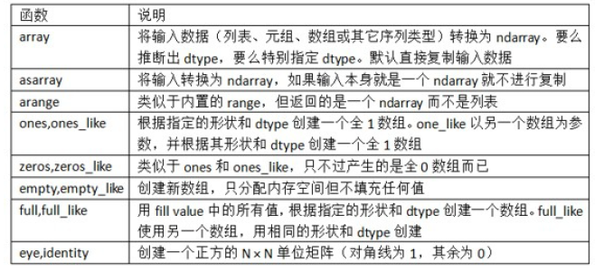
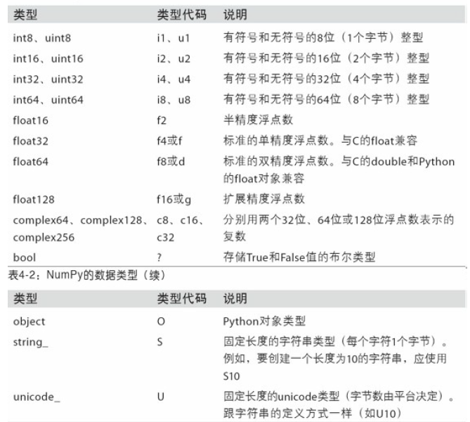
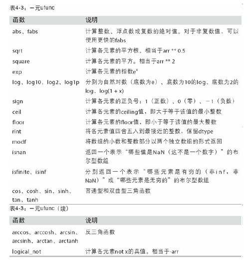
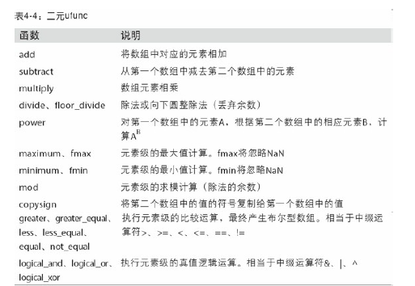
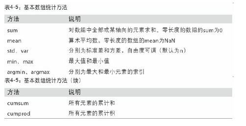
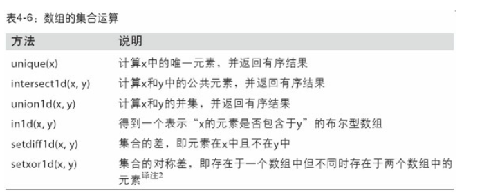
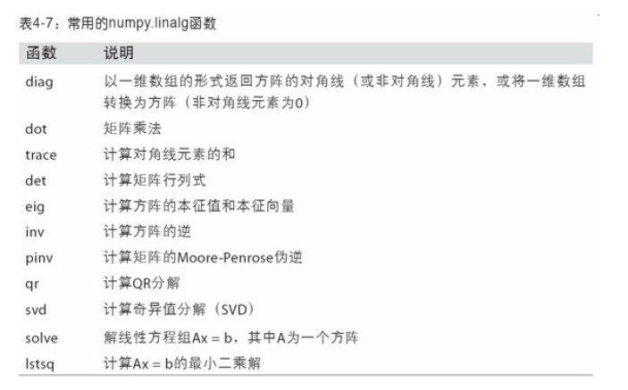
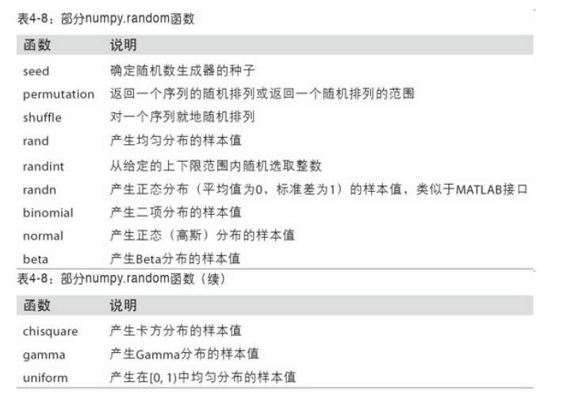
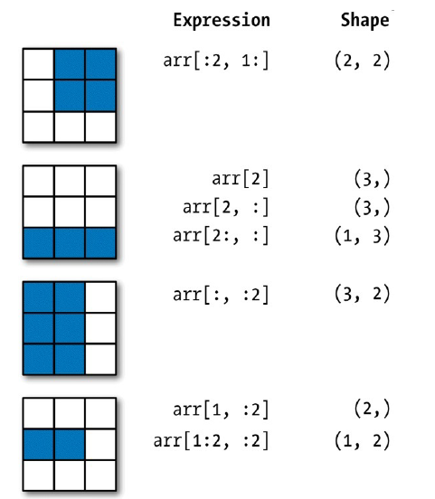
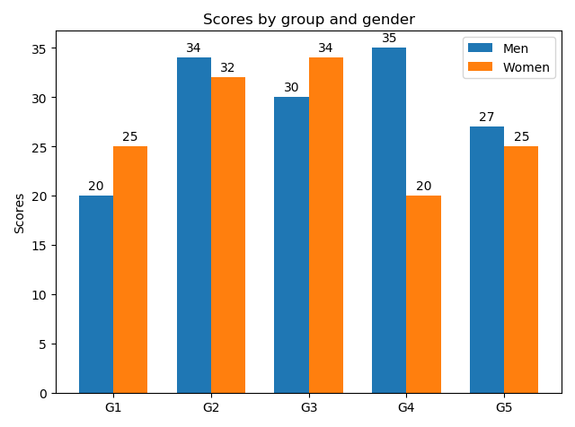

# day01

# Numpy

## 1. Numpy数组创建函数



```python
import numpy as np
data1 = [6, 7.5, 8, 0, 1]
arr1 = np.array(data1)
print(arr1)

print(np.zeros(10))
print(np.zeros((3, 6)))
print(np.empty((2, 3, 2)))
'''
[6.  7.5 8.  0.  1. ]

[0. 0. 0. 0. 0. 0. 0. 0. 0. 0.]

[[0. 0. 0. 0. 0. 0.]
 [0. 0. 0. 0. 0. 0.]
 [0. 0. 0. 0. 0. 0.]]
 
[[[1.13592437e-311 1.13592441e-311]
  [1.13592437e-311 1.13592437e-311]
  [1.13592441e-311 1.13592438e-311]]

 [[1.13592438e-311 1.13592441e-311]
  [1.13592438e-311 1.13592437e-311]
  [1.13592437e-311 1.13592437e-311]]]
'''
```


## 2. Numpy的数据类型



```python
import numpy as np
arr = np.array([1, 2, 3, 4, 5])
print(arr.dtype)
float_arr = arr.astype(np.float64)
print(float_arr.dtype)
empty_uint32 = np.empty(8, dtype='u4')
print(empty_uint32)

'''
int32
float64
[         0 1075314688          0 1075707904          0 1075838976
          0 1072693248]
'''
```


## 3.Numpy通用函数





## 4.Numpy基本数组统计方法



```python
arr = np.random.randn(5, 4)
print(arr)
print(arr.mean())  #等价于
print(np.mean(arr))
print(arr.sum())

arr = np.array([[0, 1, 2], [3, 4, 5], [6, 7, 8]])
print(arr)
print(arr.cumsum(axis=0))
print(arr.cumprod(axis=1))
'''
[[ 1.27172821 -0.8008234  -1.04625142 -0.58898146]
 [-0.72831427  0.6118976  -2.01998634 -0.68089937]
 [-0.62448047 -0.50984223  0.0235974   0.05387826]
 [-0.81938758 -0.39797034 -0.11408561 -1.69166799]
 [-0.27146778 -0.47776448  0.14981344 -0.31322113]]
-0.44871144688343606
-0.44871144688343606
-8.974228937668721
[[0 1 2]
 [3 4 5]
 [6 7 8]]
[[ 0  1  2]
 [ 3  5  7]
 [ 9 12 15]]
[[  0   0   0]
 [  3  12  60]
 [  6  42 336]]

'''
```


## 5. Numpy数组的集合运算、线性代数函数和随机函数








```python
#unique
names = np.array(['Bob', 'Joe', 'Will', 'Bob', 'Will', 'Joe', 'Joe'])
print(np.unique(names))
#dot
x = np.array([[1., 2., 3.], [4., 5., 6.]])
y = np.array([[6., 23.], [-1, 7], [8, 9]])
print(x.dot(y))
print(np.dot(x, y))
#normal
samples = np.random.normal(size=(4, 4))
print(samples)
'''
['Bob' 'Joe' 'Will']
[[ 28.  64.]
 [ 67. 181.]]
[[ 28.  64.]
 [ 67. 181.]]
[[ 0.5395112  -0.39968137 -0.28545623  0.20869839]
 [-1.18807288  0.28664098 -0.97201089  2.19033692]
 [ 0.32318241 -1.73105706 -1.40760076  0.97302607]
 [-2.03907713  0.37758855  0.10993102 -0.85805154]]

'''
```


## 6.Numpy矩阵的切片和索引




```python
arr = np.array([[1, 2, 3], [4, 5, 6], [7, 8, 9]])
print(arr[:2,1:],arr[:2,1:].shape)
'''
[[2 3]
 [5 6]] (2, 2)
'''
print(arr[2],arr[2].shape)
'''
[7 8 9] (3,)
'''
print(arr[2,:],arr[2,:].shape)
'''
[7 8 9] (3,)
'''
print(arr[2:,:],arr[2:,:].shape)
'''
[[7 8 9]] (1, 3)
'''
print(arr[:,:2],arr[:,:2].shape)
'''
[[1 2]
 [4 5]
 [7 8]] (3, 2)
'''
print(arr[1,:2],arr[1,:2].shape)
'''
[4 5] (2,)
'''
print(arr[1:2,:2],arr[1:2,:2].shape)
'''
[[4 5]] (1, 2)
'''

```


# Matplotlib

https://matplotlib.org/api/

### 子图

**矩阵式布局**

绘制矩阵式子图布局相关API：

```python
mp.figure('Subplot Layout', facecolor='lightgray')
# 拆分矩阵
	# rows:	行数
    # cols:	列数
    # num:	编号
mp.subplot(rows, cols, num)
	#	1 2 3
	#	4 5 6
	#	7 8 9 
mp.subplot(3, 3, 5)		#操作3*3的矩阵中编号为5的子图
mp.subplot(335)			#简写
```

### 备注

案例：为在某条曲线上的点添加备注，指明函数方程与值。

```python
# 在图表中为某个点添加备注。包含备注文本，备注箭头等图像的设置。
mp.annotate(
    r'$\frac{\pi}{2}$',			#备注中显示的文本内容
    xycoords='data',			#备注目标点所使用的坐标系（data表示数据坐标系）
    xy=(x, y),	 				#备注目标点的坐标
    textcoords='offset points',	#备注文本所使用的坐标系（offset points表示参照点的偏移坐标系）
    xytext=(x, y),				#备注文本的坐标
    fontsize=14,				#备注文本的字体大小
    arrowprops=dict()			#使用字典定义文本指向目标点的箭头样式
)
```

### 散点图

绘制散点图的相关API：

```python
mp.scatter(
    x, 					# x轴坐标数组
    y,					# y轴坐标数组
    marker='', 			# 点型
    s=10,				# 大小
    color='',			# 颜色
    edgecolor='', 		# 边缘颜色
    facecolor='',		# 填充色
    zorder=''			# 图层序号
)
```

### 条形图（柱状图）

绘制柱状图的相关API：

```python 
mp.figure('Bar', facecolor='lightgray')
mp.bar(
	x,				# 水平坐标数组
    y,				# 柱状图高度数组
    width,			# 柱子的宽度
    color='', 		# 填充颜色
    label='',		#
    alpha=0.2		#
)
```

### 饼图

绘制饼状图的基本API：

```python
mp.pie(
    values, 		# 值列表		
    spaces, 		# 扇形之间的间距列表
    labels, 		# 标签列表
    colors, 		# 颜色列表
    '%d%%',			# 标签所占比例格式
	shadow=True, 	# 是否显示阴影
    startangle=90	# 逆时针绘制饼状图时的起始角度
    radius=1		# 半径
)
```

### 柱状图案例：



```python
import matplotlib
import matplotlib.pyplot as plt
import numpy as np

#将数据集分为五组，设定标签
labels = ['G1', 'G2', 'G3', 'G4', 'G5']
men_means = [20, 34, 30, 35, 27]     #男性的平均得分
women_means = [25, 32, 34, 20, 25]   #女性的平均得分

x = np.arange(len(labels))  # 标签位置
width = 0.35  # 宽度

fig, ax = plt.subplots()
rects1 = ax.bar(x - width/2, men_means, width, label='Men') #在x - width/2处绘制男性平均得分的柱状图
rects2 = ax.bar(x + width/2, women_means, width, label='Women')   #在x + width/2处绘制女性平均得分的柱状图

#加上标签，标题和自定义x轴刻度标签等信息 
ax.set_ylabel('Scores') #设置y轴文本
ax.set_title('Scores by group and gender') #设置柱状图标题
ax.set_xticks(x) #设置x轴刻度值
ax.set_xticklabels(labels) #设置x轴刻度标签文本
ax.legend()

#给每个矩阵添加上数值
def autolabel(rects):
    for rect in rects:
        height = rect.get_height()
        #添加备注
        ax.annotate('{}'.format(height),
                    xy=(rect.get_x() + rect.get_width() / 2, height),  #备注目标点的坐标
                    xytext=(0, 3),  # 在x轴偏移0，在y轴偏移3
                    textcoords="offset points",  #备注文本所使用的坐标系
                    ha='center', va='bottom')
'''  
xy=(横坐标，纵坐标)  即目标点的坐标
xytext=(横坐标，纵坐标) 文字的坐标，指的是文字框最左边的坐标
xycoords='data',			#备注目标点所使用的坐标系（data表示数据坐标系）
textcoords='offset points',	#备注文本所使用的坐标系（offset points表示参照点的偏移坐标系）
ha=horizontalalignment 垂直对齐
va=verticalalignment 水平对齐
''' 
autolabel(rects1)
autolabel(rects2)
#设置紧凑布局
fig.tight_layout()
plt.show()
```


