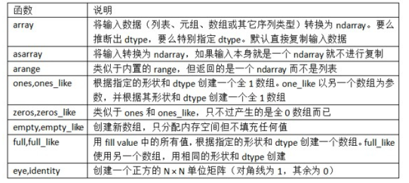
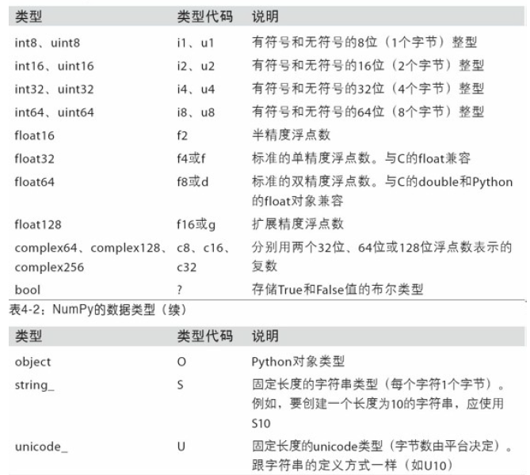
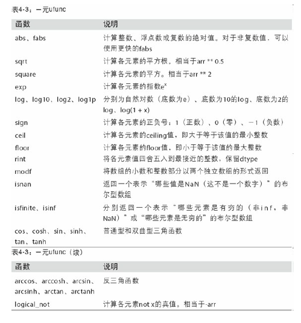
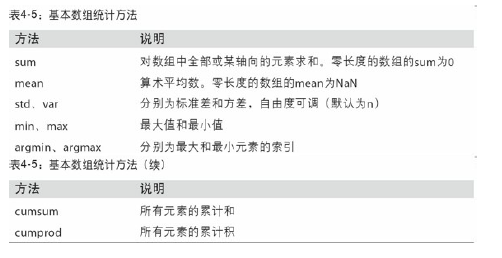
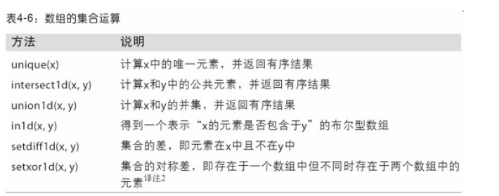
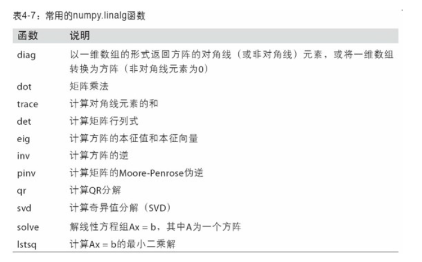
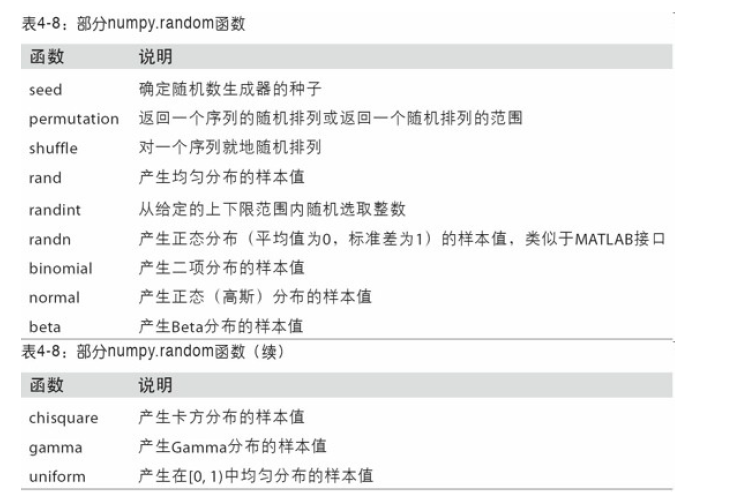
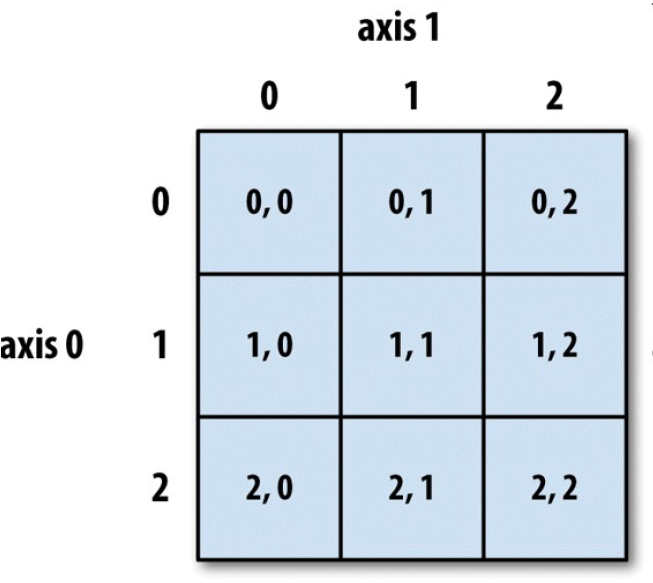
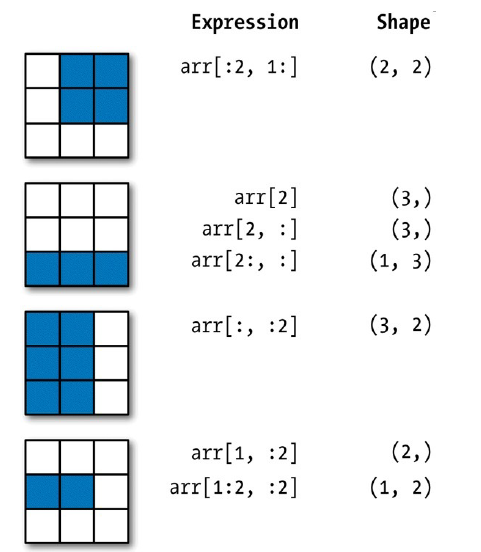
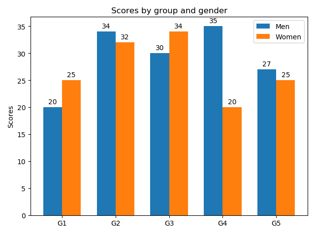

# day01

# Numpy

## 1. Numpy数组创建函数



```python
import numpy as np
data1 = [6, 7.5, 8, 0, 1]
arr1 = np.array(data1)
print(arr1)

print(np.zeros(10))
print(np.zeros((3, 6)))
print(np.empty((2, 3, 2)))
'''
[6.  7.5 8.  0.  1. ]

[0. 0. 0. 0. 0. 0. 0. 0. 0. 0.]

[[0. 0. 0. 0. 0. 0.]
 [0. 0. 0. 0. 0. 0.]
 [0. 0. 0. 0. 0. 0.]]
 
[[[1.13592437e-311 1.13592441e-311]
  [1.13592437e-311 1.13592437e-311]
  [1.13592441e-311 1.13592438e-311]]

 [[1.13592438e-311 1.13592441e-311]
  [1.13592438e-311 1.13592437e-311]
  [1.13592437e-311 1.13592437e-311]]]
'''
```


## 2. Numpy的数据类型



```python
import numpy as np
arr = np.array([1, 2, 3, 4, 5])
print(arr.dtype)
float_arr = arr.astype(np.float64)
print(float_arr.dtype)
empty_uint32 = np.empty(8, dtype='u4')
print(empty_uint32)

'''
int32
float64
[         0 1075314688          0 1075707904          0 1075838976
          0 1072693248]
'''
```


## 3.Numpy通用函数




## 4.Numpy基本数组统计方法



```python
arr = np.random.randn(5, 4)
print(arr)
print(arr.mean())  #等价于
print(np.mean(arr))
print(arr.sum())

arr = np.array([[0, 1, 2], [3, 4, 5], [6, 7, 8]])
print(arr)
print(arr.cumsum(axis=0))
print(arr.cumprod(axis=1))
'''
[[ 1.27172821 -0.8008234  -1.04625142 -0.58898146]
 [-0.72831427  0.6118976  -2.01998634 -0.68089937]
 [-0.62448047 -0.50984223  0.0235974   0.05387826]
 [-0.81938758 -0.39797034 -0.11408561 -1.69166799]
 [-0.27146778 -0.47776448  0.14981344 -0.31322113]]
-0.44871144688343606
-0.44871144688343606
-8.974228937668721
[[0 1 2]
 [3 4 5]
 [6 7 8]]
[[ 0  1  2]
 [ 3  5  7]
 [ 9 12 15]]
[[  0   0   0]
 [  3  12  60]
 [  6  42 336]]

'''
```


## 5. Numpy数组的集合运算、线性代数函数和随机函数








```python
#unique
names = np.array(['Bob', 'Joe', 'Will', 'Bob', 'Will', 'Joe', 'Joe'])
print(np.unique(names))
#dot
x = np.array([[1., 2., 3.], [4., 5., 6.]])
y = np.array([[6., 23.], [-1, 7], [8, 9]])
print(x.dot(y))
print(np.dot(x, y))
#normal
samples = np.random.normal(size=(4, 4))
print(samples)
'''
['Bob' 'Joe' 'Will']
[[ 28.  64.]
 [ 67. 181.]]
[[ 28.  64.]
 [ 67. 181.]]
[[ 0.5395112  -0.39968137 -0.28545623  0.20869839]
 [-1.18807288  0.28664098 -0.97201089  2.19033692]
 [ 0.32318241 -1.73105706 -1.40760076  0.97302607]
 [-2.03907713  0.37758855  0.10993102 -0.85805154]]

'''
```


## 6.Numpy矩阵的切片和索引





```python
arr = np.array([[1, 2, 3], [4, 5, 6], [7, 8, 9]])
print(arr[:2,1:],arr[:2,1:].shape)
'''
[[2 3]
 [5 6]] (2, 2)
'''
print(arr[2],arr[2].shape)
'''
[7 8 9] (3,)
'''
print(arr[2,:],arr[2,:].shape)
'''
[7 8 9] (3,)
'''
print(arr[2:,:],arr[2:,:].shape)
'''
[[7 8 9]] (1, 3)
'''
print(arr[:,:2],arr[:,:2].shape)
'''
[[1 2]
 [4 5]
 [7 8]] (3, 2)
'''
print(arr[1,:2],arr[1,:2].shape)
'''
[4 5] (2,)
'''
print(arr[1:2,:2],arr[1:2,:2].shape)
'''
[[4 5]] (1, 2)
'''

```


# Matplotlib

https://matplotlib.org/api/

### 子图

**矩阵式布局**

绘制矩阵式子图布局相关API：

```python
mp.figure('Subplot Layout', facecolor='lightgray')
# 拆分矩阵
	# rows:	行数
    # cols:	列数
    # num:	编号
mp.subplot(rows, cols, num)
	#	1 2 3
	#	4 5 6
	#	7 8 9 
mp.subplot(3, 3, 5)		#操作3*3的矩阵中编号为5的子图
mp.subplot(335)			#简写
```

### 备注

案例：为在某条曲线上的点添加备注，指明函数方程与值。

```python
# 在图表中为某个点添加备注。包含备注文本，备注箭头等图像的设置。
mp.annotate(
    r'$\frac{\pi}{2}$',			#备注中显示的文本内容
    xycoords='data',			#备注目标点所使用的坐标系（data表示数据坐标系）
    xy=(x, y),	 				#备注目标点的坐标
    textcoords='offset points',	#备注文本所使用的坐标系（offset points表示参照点的偏移坐标系）
    xytext=(x, y),				#备注文本的坐标
    fontsize=14,				#备注文本的字体大小
    arrowprops=dict()			#使用字典定义文本指向目标点的箭头样式
)
```

### 散点图

绘制散点图的相关API：

```python
mp.scatter(
    x, 					# x轴坐标数组
    y,					# y轴坐标数组
    marker='', 			# 点型
    s=10,				# 大小
    color='',			# 颜色
    edgecolor='', 		# 边缘颜色
    facecolor='',		# 填充色
    zorder=''			# 图层序号
)
```

### 条形图（柱状图）

绘制柱状图的相关API：

```python 
mp.figure('Bar', facecolor='lightgray')
mp.bar(
	x,				# 水平坐标数组
    y,				# 柱状图高度数组
    width,			# 柱子的宽度
    color='', 		# 填充颜色
    label='',		#
    alpha=0.2		#
)
```

### 饼图

绘制饼状图的基本API：

```python
mp.pie(
    values, 		# 值列表		
    spaces, 		# 扇形之间的间距列表
    labels, 		# 标签列表
    colors, 		# 颜色列表
    '%d%%',			# 标签所占比例格式
	shadow=True, 	# 是否显示阴影
    startangle=90	# 逆时针绘制饼状图时的起始角度
    radius=1		# 半径
)
```

### 柱状图案例：



```python
import matplotlib
import matplotlib.pyplot as plt
import numpy as np

#将数据集分为五组，设定标签
labels = ['G1', 'G2', 'G3', 'G4', 'G5']
men_means = [20, 34, 30, 35, 27]     #男性的平均得分
women_means = [25, 32, 34, 20, 25]   #女性的平均得分

x = np.arange(len(labels))  # 标签位置
width = 0.35  # 宽度

fig, ax = plt.subplots()
rects1 = ax.bar(x - width/2, men_means, width, label='Men') #在x - width/2处绘制男性平均得分的柱状图
rects2 = ax.bar(x + width/2, women_means, width, label='Women')   #在x + width/2处绘制女性平均得分的柱状图

#加上标签，标题和自定义x轴刻度标签等信息 
ax.set_ylabel('Scores') #设置y轴文本
ax.set_title('Scores by group and gender') #设置柱状图标题
ax.set_xticks(x) #设置x轴刻度值
ax.set_xticklabels(labels) #设置x轴刻度标签文本
ax.legend()

#给每个矩阵添加上数值
def autolabel(rects):
    for rect in rects:
        height = rect.get_height()
        #添加备注
        ax.annotate('{}'.format(height),
                    xy=(rect.get_x() + rect.get_width() / 2, height),  #备注目标点的坐标
                    xytext=(0, 3),  # 在x轴偏移0，在y轴偏移3
                    textcoords="offset points",  #备注文本所使用的坐标系
                    ha='center', va='bottom')
'''  
xy=(横坐标，纵坐标)  即目标点的坐标
xytext=(横坐标，纵坐标) 文字的坐标，指的是文字框最左边的坐标
xycoords='data',			#备注目标点所使用的坐标系（data表示数据坐标系）
textcoords='offset points',	#备注文本所使用的坐标系（offset points表示参照点的偏移坐标系）
ha=horizontalalignment 垂直对齐
va=verticalalignment 水平对齐
''' 
autolabel(rects1)
autolabel(rects2)
#设置紧凑布局
fig.tight_layout()
plt.show()
```

# day2

# 数理统计

## 1.总体数据和样本数据

**总体**（Population）又称为**母体**或**整体**，是指统计学中是指由许多有某种共同性质的事物组成的集合。

**样本**（Sample）是统计学术语，指从全体中抽取的个体。通过对样本的调查，可以大概的了解总体的情况。

随机抽样：用随机的方式从总体数据中产生具有代表性的样本。

## 2.数量数据和属性数据

**数量数据**（Quantitative data）：能够进行加减乘除等数值和算术运算的数据。

**属性数据**（Categorical  data）：不能进行算术运算的数据。


## 3.截面数据和时间序列数据

**截面数据**（Cross-sectional data）：在同一时间或几乎相同的时间下搜集来一些个体的数据。

**时间序列数据**（Time series data）：搜集的是几个时期的数据。

2002-2013道琼斯指数波动图


## 4.数据的分布

#### 1.属性数据的频数分布（Frequency distribution)

频数分布：主要用于对数据的提炼和压缩，反应了各个不重叠组观察值出现的次数（频数）。


#### 2.频率分布

频率分布是指每个组别中观察值出现的比例或百分比。

| 饮料名称  | 频率 | 百分比（%） |
| --------- | ---- | ----------- |
| Coca-Cola | 0.38 | 38          |
| Diet Coke | 0.16 | 16          |
| Dr.Pepper | 0.10 | 10          |
| Pepsi     | 0.26 | 26          |
| Sprite    | 0.10 | 10          |
| 合计      | 1.00 | 100         |

#### 3.数量数据的频率分布

对数量性质的数据，要编制频数分布，首先需要规定分组的组别。

确定数量数据分组组别，需要经过以下三个步骤：

1. 确定分多少组

2. 确定每个组的组距

   组上下限之间的差叫作组距

3. 确定每个组的组限

   组限是每个组之间的界限，反映了每个组观察值的变化范围。每个组的下限代表着这组中的最小观察值，每个组的上限代表着该组中的最大观察值。

```python
import numpy as np

Data = [14,19,24,19,16,20,24,20,21,22,
        24,18,17,23,26,22,23,25,25,19,
        18,16,15,24,21,16,19,21,23,20,
        22,22,16,16,16,12,25,19,24,20]
# 求极差
ptpd = np.ptp(Data)
# 求最大值
maxd = np.max(Data)
# 求最小值
mind = np.min(Data)
print(ptpd)
14
print(maxd)
26
print(mind)
12
# 设置组限
Top = 30
Bottom = 10
# 分组为4，求组距
P = (Top - Bottom)/4
# 对组距向上取整
print(np.ceil(P))
5.0
```

| 分组  | 频数 | 频率  | 百分比 % |
| ----- | ---- | ----- | -------- |
| 11-15 | 3    | 0.075 | 7.5      |
| 16-20 | 18   | 0.45  | 45       |
| 21-25 | 18   | 0.45  | 45       |
| 26-30 | 1    | 0.025 | 2.5      |
| 总数  | 40   | 1     | 100      |

#### 4.累积分布

累积分布：另外一种形式的频数分布，可以用来说明数量数据分布的变化。

np.cumsum(axis=0)

np.cumprod(axis=1)

| 分组  | 累积频数 | 累积频率 | 累积百分比 % |
| ----- | -------- | -------- | ------------ |
| 11-15 | 3        | 0.075    | 7.5          |
| 16-20 | 21       | 0.525    | 52.5         |
| 21-25 | 39       | 0.975    | 97.5         |
| 26-30 | 40       | 1        | 100          |

## 5.位置测度

#### 1.均值（算术平均和加权平均）

样本中的每个值都是真值与误差的和。

```
S = [s1, s2, ..., sn]
算数平均值：
m = (s1 + s2 + ... + sn) / n
np.mean(S)

W=[w1,w2,...wn]
加权平均值：
a = (s1w1+s2w2+...snwn)/(w1+w2+...wn)
np.average(S, weights = W)
```


#### 2.中位数

将多个样本按照大小排序，取中间位置的元素。

**若样本数量为奇数，中位数为最中间的元素**

**若样本数量为偶数，中位数为最中间的两个元素的平均值**

```
median = np.median(Data)
```

#### 3.众数（mode）

众数是一组数据中出现次数最多的数值，有时众数在一组数中有好几个。

```
# 求众数
counts = np.bincount(Data)
np.argmax(counts)
```


#### 4.几何平均（geometric mean）


```
from scipy import stats 
stats.gmean(Data)
```


## 6.变异性测量

#### 1.极差

极差 = 最大值 - 最小值

```
求极差
np.ptp(Data)
```

#### 2.方差（Variance）

**方差**（Variance）描述的是它的离散程度，也就是该变量离其期望值的距离。

方差：v = (q1+q2+...+qn)/n

样本方差：Sv = (q1+q2+...+qn)/(n-1)
$$
方差： \quad Var=\frac1N∑^N_{i=1}(X_i−\overline X)^2
\\
样本方差：  \quad Svar=\frac{1}{N-1}∑^N_{i=1}(X_i−\overline X)^2
$$
方差公式中分母上是N；样本方差无偏估计公式中分母上是N-1 （N为样本个数）。

```
求方差
np.var(Data)
```


#### 3.标准差 (**S**tandard **D**eviation)

方差的正平方根称为该随机变量的**标准差**，在概率统计中用来测量一组数值的离散程度。
$$
标准差：\quad Std=\sqrt{Var}
\\
样本标准差：\quad Sstd=\sqrt{Svar}
$$

```
求标准差
np.std(Data)
```


#### 4.变异系数 (Coefficient of Variation)

在概率论和统计学中，**变异系数**，又称“离散系数”（coefficient of variation），是概率分布离散程度的一个归一化量度，其定义为标准差与平均值之比：
$$
变异系数=\frac{标准差}{均值} \times  100
$$
变异系数只在平均值不为零时有定义，而且一般适用于平均值大于零的情况。变异系数也被称为**标准离差率**或**单位风险**。

## 7.分布分析

#### 1.百分位数（Percentile）

**百分位数**，统计学术语，如果将一组数据从小到大排序，并计算相应的累计百分位，则某一百分位所对应数据的值就称为这一百分位的百分位数，是低于某个观察值的观察值数目占全部观察值的百分比。

以 $P_k$ 表示第k百分位数， $P_k$ 表示至少有k%的资料小于或等于这个数，而同时也有(100-k)%的资料大于或等于这个数。

```
求百分位数
np.percentile(Data, 25)
np.percentile(Data, 75)

```

#### 2.四分位数（Quartile）

**四分位数**是统计学中分位数的一种，即把所有数值由小到大排列并分成四等份，处于三个分割点位置的数值就是四分位数。

 ${\displaystyle Q_{1}}$＝第一个四分位数，或者第25个百分位数。

${\displaystyle Q_{2}}$ ＝第二个四分位数，或者第50个百分位数，也就是中位数。

 ${\displaystyle Q_{3}}$ = 第三个四分位数，或者第75个百分位数。

四分位距 = ${\displaystyle Q_{3}}-{\displaystyle Q_{1}}$

```
求四分位数
np.percentile(Data, (25, 50, 75))

```


#### 3.z值（z-score）

z值（z-score），也叫标准分数（standard score）是一个数与平均数的差再除以标准差的过程。

Z值的量代表着原始分数和**母体平均值**之间的距离，是以标准差为单位计算。在原始分数低于平均值时Z则为负数，反之则为正数。换句话说，Z值是从感兴趣的点到均值之间有多少个标准差。
$$
z= \frac{X_i−\overline X}{Sv}
$$


## 8.两个变量之间的关系

#### 1.协方差 (Covariance)

**协方差**（Covariance）在概率论和统计学中用于衡量**两个变量**的总体误差。而方差是协方差的一种特殊情况，即当两个变量是相同的情况。
$$
样本协方差：  \quad Cov=\frac{1}{N-1}∑^N_{i=1}(X_i−\overline X)(Y_i-\overline Y)
$$

```
numpy.cov(Data)

```

如果两个变量的变化趋势**一致**，那么两个变量之间的协方差就是**正值**。

如果两个变量的变化趋势**相反**，那么两个变量之间的协方差就是**负值**。

#### 2.相关系数（correlation coefficient）

在统计学中，**皮尔逊积矩相关系数**用于度量两个变量X和Y之间的相关程度（线性相关），其值介于-1与1之间。在自然科学领域中，该系数广泛用于度量**两个变量之间的线性相关程度**。

两个变量之间的皮尔逊相关系数定义为两个变量之间的协方差和标准差的商：
$$
r(X,Y)=\frac{Cov(X,Y)}{Std(X)Std(Y)}
$$
r 取值范围 [-1,1]，如果r为正数，则X，Y为正相关；r为负数，则X，Y为负相关；若r=0，则X，Y不相关。

相关性大小的判断：


# 线性回归分析

## 自变量和因变量、线性回归和多元回归

在回归范畴中，被预测的变量称作因变量，或者响应变量、被解释变量。

用来预测因变星的变量，称作自变量，或者预测变量、解释变量。

包含一个自变量和一个因变量的回归分析，称之为简单回归。

统计学中，一般用 y 表示因变量，x 表示自变量。自变量x任何一个单位的变化，会导致因变量 y 相同变化的回归分析，被称作线性回归。包含两个或两个以上自变量的回归分析，叫作多元回归。

### 残差 (Residual)：

因变量**实际值**和使用估计得回归方程得到的因变量**预测值**之间的离差。对于第 i 个观察值，残差可以表示为：
$$
e_i=y_i-\hat y_i
$$


## 1.简单线性回归模型


线性回归方程:
$$
y=kx+b+e
$$
根据线型 y=kx + b +e 方程可得：

```python
kx1 + b + e1 = y1
kx2 + b + e2 = y2
kx3 + b + e3 = y3
...
kxn + b + en = yn

```

$$
\left[ \begin{array}{ccc}x{_1} & 1\\x{_2} & 1\\x{_3} & 1 \\x{_n} & 1 \\\end{array} \right ]\times\left[ \begin{array}{ccc}k\\b\\\end{array} \right ]=\left[ \begin{array}{ccc}y{_1}\\y{_2}\\y{_3}\\y{_n}\\\end{array} \right ]
$$

样本过多，每两组方程即可求得一组k与b的值。np.linalg.lstsq(a, b) 可以通过最小二乘法求出所有结果中拟合误差最小的k与b的值。

案例：


```python
import numpy as np
import matplotlib.pyplot as mp

Data = np.loadtxt(r'C:\Users\Administrator\Desktop\Tyler.txt')
print(Data)
x1= Data[:,0]
x2 = Data[:,1]
y = Data[:,2]

parameter = np.polyfit(x1, y,1)

mp.figure('scatter', facecolor='lightgray')
mp.title('scatter')
mp.scatter(x1, y,color="r")
x = np.linspace(x1.min(), x1.max(), 1000)
y = np.polyval(parameter, x)
mp.plot(x, y)
mp.show()


```


